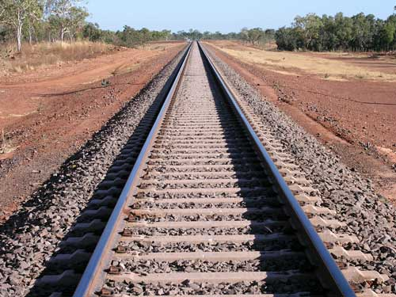

# Railway-Track_lines-detection
Detect Railway track lines using Canny Edges and HoughLines

Input Image:

Output Image:

Python libraries Required:
1. OpenCV (I used verion 4.0)
2. Numpy

Compile:
> python railway_track_lines_detection.py
